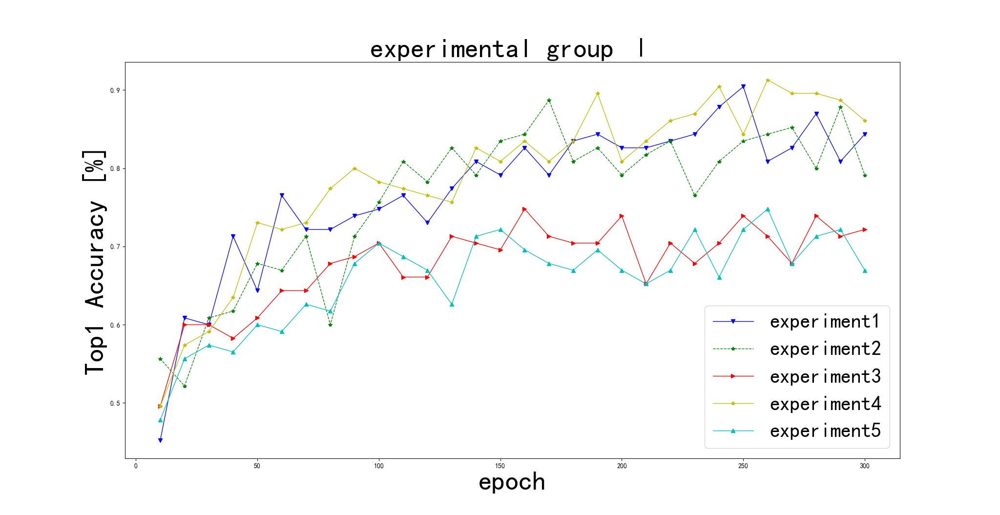
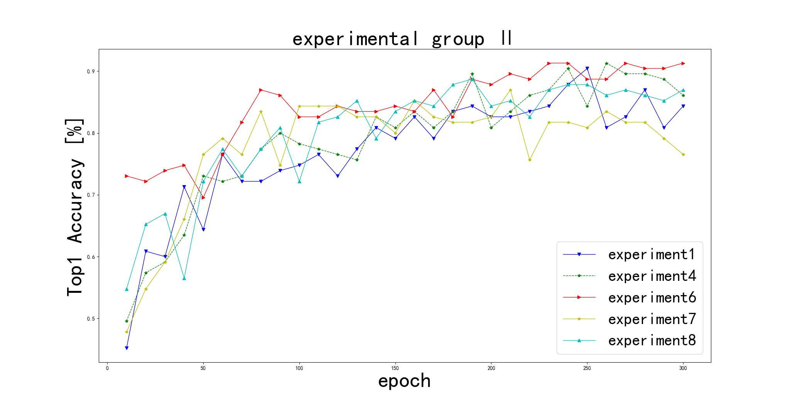

# Overlap_DeiT

**Abstract**—In order to improve the ViT model accuracy of image classification task in Chinese medicine, this paper proposes a sharpening image preprocessing method of coupling residual algorithm, the image preprocessing method can make deep learning network makes it easier to extract the image edge character. In this paper,through a series of experiments to compare the algorithm under different parameters in traditional Chinese medicine classification accuracy of the data sets. Improved the vision Transformer structure of knowledge distillation and proposed the way of overlapping image blocks in PatchEmbeding operation to extract more information of the original image. A series of experiments were carried out on the traditional Chinese medicine data set. It is proved that the accuracy of the model is about 2% higher than that of the original knowledge distillation ViT structure.

paper:[CCET2022.pdf](doc/CCET2022.pdf)

    
     
    
第一实验组

    
     
    
第二实验组

